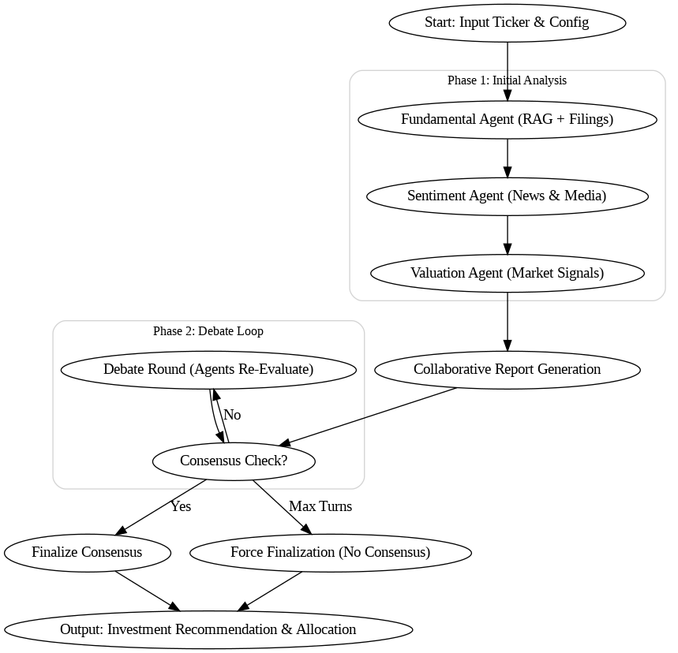

# AlphaAgents: A Multi-Agent Financial Analysis System

[](https://www.python.org/downloads/release/python-3110/)
[](https://opensource.org/licenses/MIT)

This repository is a full, end-to-end implementation of the **"AlphaAgents"** research paper (arXiv:2508.11152). It demonstrates a multi-agent system where specialized AI agents (Fundamental, Sentiment, Valuation) collaborate via an iterative debate loop to produce investment recommendations and reproducible back-tested portfolio strategies.

**Paper:** *AlphaAgents: Large Language Model based Multi-Agents for Equity Portfolio Constructions* — arXiv:2508.11152. ([https://arxiv.org/abs/2508.11152](https://arxiv.org/abs/2508.11152))

---

## Disclaimer

This project is for **research and educational purposes only**. Nothing in this repository constitutes financial, investment, legal, or tax advice. Backtests are historical and illustrative — past performance is not an indicator of future results. Do not trade real capital solely on outputs from this system.

---

## Key Features

* **Multi-Agent Debate Loop** — Agents iteratively debate and update their views to reduce bias and improve decision quality.
* **Specialized Agents** — Three agent roles: **Fundamental** (RAG from filings), **Sentiment** (news summarization & scoring), and **Valuation** (price-based metrics & signals).
* **RAG-Powered Analysis** — Retrieval-Augmented Generation pipeline using ChromaDB for filing/document retrieval.
* **Back-testing Engine** — Rolling/backtest simulation versus a benchmark (S\&P 500) with standard risk/performance metrics.
* **Provenance & Explainability** — Agent outputs are schema-validated and stored with retrieval provenance for traceability.

---

## System Workflow

The per-ticker pipeline:




## Technology Stack

* **Orchestration**: LangGraph
* **LLM Provider**: Groq — this code uses **GPT-OSS-120B** (see Configuration).
* **Framework**: LangChain (v3)
* **Vector DB**: ChromaDB
* **Data & Analysis**: pandas, yfinance, numpy
* **Embedding model**: sentence-transformers (configurable)
* **Plotting**: Matplotlib

---

## Important: Model & Cost Notes

* This repository defaults to **GPT-OSS-120B** for agent reasoning. That model is large and **can incur substantial inference cost and latency**.
* For development or cost-sensitive experiments you may want to run a smaller model (locally or via a different provider) — adjust `GROQ_MODEL` or your runtime configuration accordingly, but production code and main experiments are designed with GPT-OSS-120B in mind.
* Be mindful of rate limits and API quotas on your Groq account.

---

## Setup & Quickstart

> Tested with Python 3.11. For reproducibility, use the pinned `requirements.txt`.

### 1. Clone

```bash
git clone https://github.com/vedurmaaliya/AlphaAgents.git
cd AlphaAgents
```

### 2. Create and activate a virtual environment

**macOS / Linux**

```bash
python -m venv venv
source venv/bin/activate
```

**Windows (PowerShell)**

```powershell
python -m venv venv
venv\Scripts\Activate.ps1
```

### 3. Install dependencies

```bash
pip install -r requirements.txt
```

### 4. Configure environment variables

Copy example and edit:

**Unix / macOS**

```bash
cp .env.example .env
# edit .env and add your keys
```

**Windows (PowerShell)**

```powershell
Copy-Item .env.example .env
# edit .env using your favorite editor
```

Minimum env vars required (example):

```text
GROQ_API_KEY=sk-...
# Optionally:
GROQ_MODEL=gpt-oss-120b  # the code defaults to 120B
LANGGRAPH_API_KEY=...
NEWSAPI_KEY=...
```

> By default the code uses GPT-OSS-120B. If you change `GROQ_MODEL`, ensure you understand cost/latency implications.

### 5. Ingest sample data

Populate filings, news and price history for your universe:

```bash
# Ingest financial documents for the universe (SEC filings)
python scripts/ingest_documents.py

# Ingest price history for specific tickers
python scripts/ingest_prices.py --ticker AAPL
python scripts/ingest_prices.py --ticker MSFT
# ... repeat for other tickers
```

**Data licensing note:** SEC filings are public domain. News content may be subject to API/provider licensing — check terms before redistributing or rehosting.

### 6. Run a single-ticker PoC (quick check)

```bash
python orchestration/run_one_round.py --ticker AAPL
```

This runs one full round of agents and saves the run artifact in `runs/`.

### 7. Run the backtest

```bash
python backtest/run_backtest.py
# Results and plots will be stored in `runs/` and `outputs/` (see repo structure)
```

---

## Reproducibility & Versions

We recommend using the pinned `requirements.txt`. Key versions used during development:

* Python 3.11
* langchain >=3.0.0,<4.0.0
* langchain-groq (compatible with langchain v3)
* chromadb, sentence-transformers, pandas, numpy, yfinance, matplotlib

If you encounter dependency issues create a fresh virtualenv and re-run `pip install -r requirements.txt`.

---

## Outputs & Artifacts

Typical outputs produced by this project:

* Per-run JSON traces containing agent outputs, retrieval provenance and consensus decisions (`runs/*.json`).
* Backtest performance plots (cumulative returns vs benchmark), metrics (Sharpe, drawdown), and CSV summary reports (`outputs/`).
* Notebooks demonstrating analysis and figure generation (`notebooks/`).

---

## Troubleshooting & Tips

* If LLM calls fail, check `GROQ_API_KEY`, `GROQ_MODEL`, and network connectivity.
* If retrieval returns no results, ensure you have run document ingestion and that the collection contains documents.
* For local development, test with a single ticker and a small date range to reduce API usage.
* Add logging around `groq_chat()` calls to capture raw model responses for debugging malformed JSON outputs.

---

## Contributing

Contributions, issues and feature requests are welcome. Please open an issue or a pull request. If you submit PRs that change model usage or the experimental pipeline, include updated experiment logs and CI checks.

---

## Acknowledgments

This project is an implementation of the research and concepts presented in the paper **"AlphaAgents: Large Language Model based Multi-Agents for Equity Portfolio Constructions"**. All credit for the original architecture and ideas belongs to the paper authors.

**Paper:** arXiv:2508.11152 — [https://arxiv.org/abs/2508.11152](https://arxiv.org/abs/2508.11152)

---

## License

This project is released under the **MIT License**. See `LICENSE` for details.

---
